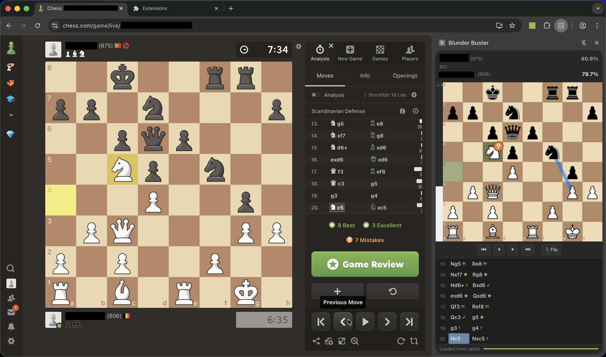

# Blunder Buster

[](https://github.com/MaartenEvenepoel/blunder-buster/actions/workflows/ci.yml)
[](LICENSE)
[](https://www.google.com/chrome/)

A Chromium browser extension that analyses your chess.com games with a local Stockfish engine — no account, no subscription, no data leaves your browser.

When a game finishes on chess.com the extension automatically opens a side panel, fetches the game, runs it through Stockfish, and shows you a move-by-move breakdown with accuracy scores, move classifications, an evaluation bar, and a best-move arrow. You can also navigate freely through the game and branch off into alternative lines to explore what you should have played instead.



---

## Features

- **Automatic detection** — detects when a game ends on chess.com and triggers analysis without any manual action
- **Local Stockfish engine** — analysis runs entirely in your browser using Stockfish 16 NNUE via WebAssembly; nothing is sent to a server
- **Move classifications** — every move is labelled: Brilliant, Great, Best, Excellent, Good, Inaccuracy, Mistake, Blunder, Miss, or Book
- **Accuracy scores** — per-player accuracy percentage calculated with the same formula chess.com uses
- **Interactive board** — navigate moves with arrow keys or by clicking the move list; drag and drop pieces to make moves
- **Deviation mode** — make any move on the board to explore an alternative line; the engine evaluates the resulting position in real time
- **Evaluation bar** — animated bar showing the engine's assessment at every position
- **Best-move arrow** — blue arrow highlighting the engine's top suggestion for the next move
- **Opening detection** — opening name shown in the header using ECO codes from the PGN
- **Result cache** — completed analyses are stored locally; revisiting a game loads instantly from cache (up to 20 games)

---

## Installation

### Prerequisites

- **Node.js 18+** (for the one-time setup step)
- **Google Chrome 114+** or any Chromium-based browser (Edge, Brave, Arc, …)

### Steps

```bash
# 1. Clone the repository
git clone https://github.com/MaartenEvenepoel/blunder-buster.git
cd blunder-buster

# 2. Install dependencies and copy library files + piece SVGs into place
npm install
npm run setup
```

Then load it as an unpacked extension:

1. Open `chrome://extensions` in your browser
2. Enable **Developer mode** (toggle in the top-right corner)
3. Click **Load unpacked** and select the `blunder-buster` folder
4. The Blunder Buster icon will appear in your toolbar

### Usage

1. Go to [chess.com](https://www.chess.com) and play (or navigate to) a game
2. When the game ends the side panel opens automatically — or click the Blunder Buster icon in the toolbar to open it manually
3. The first time you open a historical game you will be asked for your chess.com username (stored locally, never transmitted except to the chess.com public API)
4. Navigate moves with the **← →** arrow keys or by clicking entries in the move list
5. Drag a piece on the board to any legal square to explore an alternative line; click **Return to game** or press **←** to go back

---

## Tech stack

| Component | Technology |
|---|---|
| Extension platform | Chrome Manifest V3, Side Panel API |
| Chess engine | [Stockfish 16](https://stockfishchess.org/) single-thread WASM (`stockfish` npm package) |
| Move generation / PGN | [chess.js v1.1](https://github.com/jhlywa/chess.js) |
| Board rendering | HTML5 Canvas 2D API |
| Piece graphics | [Lichess cburnett SVG set](https://github.com/lichess-org/lila/tree/master/public/piece/cburnett) (CC BY-SA 4.0) |
| Game data | chess.com public API (monthly archives) |

---

## Project structure

```
blunder-buster/
├── manifest.json               # MV3 extension manifest
├── background/
│   └── service-worker.js       # Receives game-over events, manages session state
├── content/
│   ├── dom-observer.js         # Detects game end on chess.com via MutationObserver
│   └── content-script.js       # Sends game info to the service worker
├── sidepanel/
│   ├── sidepanel.html          # Side panel shell
│   ├── sidepanel.js            # Main controller — loading, navigation, deviation mode
│   ├── sidepanel.css           # Dark theme styles
│   ├── board.js                # Canvas chessboard with drag-and-drop and badges
│   ├── eval-bar.js             # Animated evaluation bar component
│   └── move-list.js            # Move list with classification badges
├── analysis/
│   ├── analyzer.js             # Stockfish engine wrapper + full game analysis pipeline
│   ├── classifier.js           # Win% → move classification logic + accuracy formula
│   └── opening-book.js         # Book move detection from PGN ECO headers
├── utils/
│   ├── api.js                  # chess.com public API helpers
│   ├── pgn-parser.js           # PGN parsing, FEN replay, annotation extraction
│   └── storage.js              # chrome.storage wrappers + LRU analysis cache
├── lib/                        # Generated by `npm run setup` — do not edit
│   ├── chess.js
│   ├── stockfish.js
│   └── stockfish-nnue-16-single.wasm
├── icons/
│   ├── pieces/                 # SVG piece graphics (cburnett set, downloaded by setup)
│   └── icon*.png
└── scripts/
    └── setup.js                # One-time setup: copies libs, downloads piece SVGs
```

For a detailed explanation of the architecture and implementation, see [ARCHITECTURE.md](ARCHITECTURE.md).

---

## Contributing

Contributions are welcome. Please read [CONTRIBUTING.md](CONTRIBUTING.md) before opening a pull request.

---

## License

MIT — see [LICENSE](LICENSE) for details.

Chess piece SVGs are from the [Lichess cburnett set](https://github.com/lichess-org/lila/tree/master/public/piece/cburnett) by Colin M.L. Burnett, licensed [CC BY-SA 4.0](https://creativecommons.org/licenses/by-sa/4.0/).
